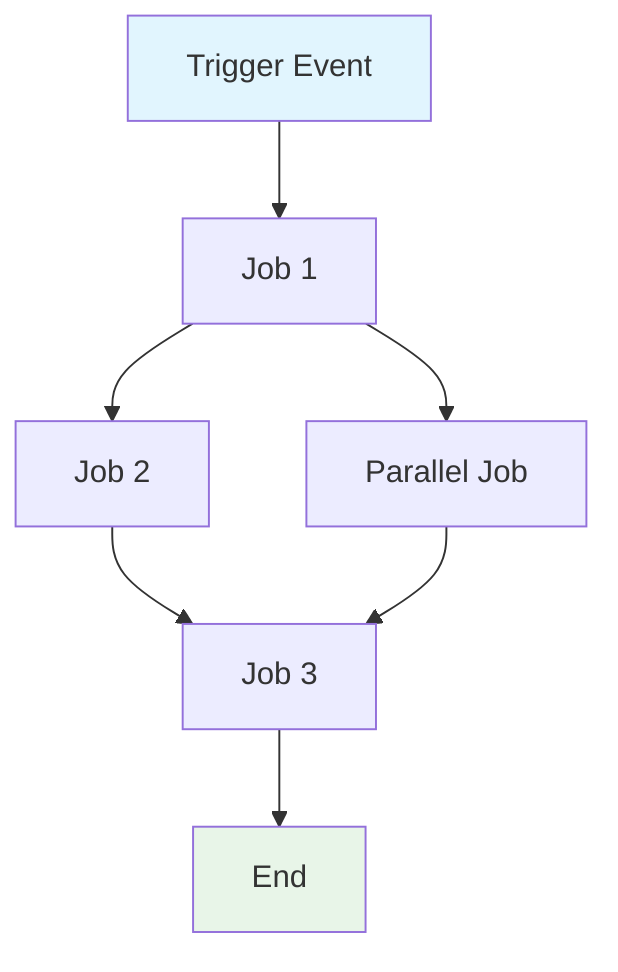
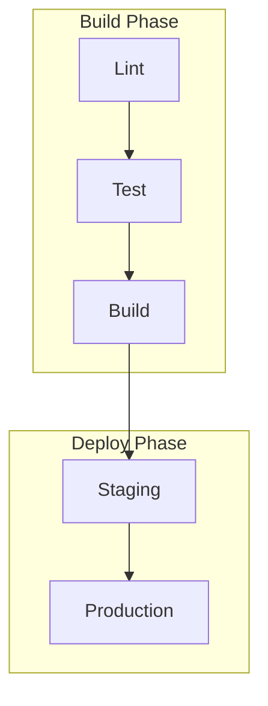

# Create GitHub Actions Workflow Specification

Create a comprehensive specification for the GitHub Actions workflow: `${input:WorkflowFile}`.

This specification serves as a specification for the workflow's behavior, requirements, and constraints. It must be implementation-agnostic, focusing on **what** the workflow accomplishes rather than **how** it's implemented.

## AI-Optimized Requirements

- **Token Efficiency**: Use concise language without sacrificing clarity
- **Structured Data**: Leverage tables, lists, and diagrams for dense information
- **Semantic Clarity**: Use precise terminology consistently throughout
- **Implementation Abstraction**: Avoid specific syntax, commands, or tool versions
- **Maintainability**: Design for easy updates as workflow evolves

## Specification Template

Save as: `/spec/spec-process-cicd-[workflow-name].md`

```md
---
title: CI/CD Workflow Specification - [Workflow Name]
version: 1.0
date_created: [YYYY-MM-DD]
last_updated: [YYYY-MM-DD]
owner: DevOps Team
tags: [process, cicd, github-actions, automation, [domain-specific-tags]]
---

## Workflow Overview

**Purpose**: [One sentence describing workflow's primary goal]
**Trigger Events**: [List trigger conditions]
**Target Environments**: [Environment scope]

## Execution Flow Diagram



## Jobs & Dependencies

| Job Name | Purpose | Dependencies | Execution Context |
|----------|---------|--------------|-------------------|
| job-1 | [Purpose] | [Prerequisites] | [Runner/Environment] |
| job-2 | [Purpose] | job-1 | [Runner/Environment] |

## Requirements Matrix

### Functional Requirements
| ID | Requirement | Priority | Acceptance Criteria |
|----|-------------|----------|-------------------|
| REQ-001 | [Requirement] | High | [Testable criteria] |
| REQ-002 | [Requirement] | Medium | [Testable criteria] |

### Security Requirements
| ID | Requirement | Implementation Constraint |
|----|-------------|---------------------------|
| SEC-001 | [Security requirement] | [Constraint description] |

### Performance Requirements
| ID | Metric | Target | Measurement Method |
|----|-------|--------|-------------------|
| PERF-001 | [Metric] | [Target value] | [How measured] |

## Input/Output Contracts

### Inputs

```yaml
# Environment Variables
ENV_VAR_1: string  # Purpose: [description]
ENV_VAR_2: secret  # Purpose: [description]

# Repository Triggers
paths: [list of path filters]
branches: [list of branch patterns]
```

### Outputs

```yaml
# Job Outputs
job_1_output: string  # Description: [purpose]
build_artifact: file  # Description: [content type]
```

### Secrets & Variables

| Type | Name | Purpose | Scope |
|------|------|---------|-------|
| Secret | SECRET_1 | [Purpose] | Workflow |
| Variable | VAR_1 | [Purpose] | Repository |

## Execution Constraints

### Runtime Constraints

- **Timeout**: [Maximum execution time]
- **Concurrency**: [Parallel execution limits]
- **Resource Limits**: [Memory/CPU constraints]

### Environmental Constraints

- **Runner Requirements**: [OS/hardware needs]
- **Network Access**: [External connectivity needs]
- **Permissions**: [Required access levels]

## Error Handling Strategy

| Error Type | Response | Recovery Action |
|------------|----------|-----------------|
| Build Failure | [Response] | [Recovery steps] |
| Test Failure | [Response] | [Recovery steps] |
| Deployment Failure | [Response] | [Recovery steps] |

## Quality Gates

### Gate Definitions

| Gate | Criteria | Bypass Conditions |
|------|----------|-------------------|
| Code Quality | [Standards] | [When allowed] |
| Security Scan | [Thresholds] | [When allowed] |
| Test Coverage | [Percentage] | [When allowed] |

## Monitoring & Observability

### Key Metrics

- **Success Rate**: [Target percentage]
- **Execution Time**: [Target duration]
- **Resource Usage**: [Monitoring approach]

### Alerting

| Condition | Severity | Notification Target |
|-----------|----------|-------------------|
| [Condition] | [Level] | [Who/Where] |

## Integration Points

### External Systems

| System | Integration Type | Data Exchange | SLA Requirements |
|--------|------------------|---------------|------------------|
| [System] | [Type] | [Data format] | [Requirements] |

### Dependent Workflows

| Workflow | Relationship | Trigger Mechanism |
|----------|--------------|-------------------|
| [Workflow] | [Type] | [How triggered] |

## Compliance & Governance

### Audit Requirements

- **Execution Logs**: [Retention policy]
- **Approval Gates**: [Required approvals]
- **Change Control**: [Update process]

### Security Controls

- **Access Control**: [Permission model]
- **Secret Management**: [Rotation policy]
- **Vulnerability Scanning**: [Scan frequency]

## Edge Cases & Exceptions

### Scenario Matrix

| Scenario | Expected Behavior | Validation Method |
|----------|-------------------|-------------------|
| [Edge case] | [Behavior] | [How to verify] |

## Validation Criteria

### Workflow Validation

- **VLD-001**: [Validation rule]
- **VLD-002**: [Validation rule]

### Performance Benchmarks

- **PERF-001**: [Benchmark criteria]
- **PERF-002**: [Benchmark criteria]

## Change Management

### Update Process

1. **Specification Update**: Modify this document first
2. **Review & Approval**: [Approval process]
3. **Implementation**: Apply changes to workflow
4. **Testing**: [Validation approach]
5. **Deployment**: [Release process]

### Version History

| Version | Date | Changes | Author |
|---------|------|---------|--------|
| 1.0 | [Date] | Initial specification | [Author] |

## Related Specifications

- [Link to related workflow specs]
- [Link to infrastructure specs]
- [Link to deployment specs]

```

## Analysis Instructions

When analyzing the workflow file:

1. **Extract Core Purpose**: Identify the primary business objective
2. **Map Job Flow**: Create dependency graph showing execution order
3. **Identify Contracts**: Document inputs, outputs, and interfaces
4. **Capture Constraints**: Extract timeouts, permissions, and limits
5. **Define Quality Gates**: Identify validation and approval points
6. **Document Error Paths**: Map failure scenarios and recovery
7. **Abstract Implementation**: Focus on behavior, not syntax

## Mermaid Diagram Guidelines

### Flow Types
- **Sequential**: `A --> B --> C`
- **Parallel**: `A --> B & A --> C; B --> D & C --> D`
- **Conditional**: `A --> B{Decision}; B -->|Yes| C; B -->|No| D`

### Styling
```mermaid
style TriggerNode fill:#e1f5fe
style SuccessNode fill:#e8f5e8
style FailureNode fill:#ffebee
style ProcessNode fill:#f3e5f5
```

### Complex Workflows
For workflows with 5+ jobs, use subgraphs:


## Token Optimization Strategies

1. **Use Tables**: Dense information in structured format
2. **Abbreviate Consistently**: Define once, use throughout
3. **Bullet Points**: Avoid prose paragraphs
4. **Code Blocks**: Structured data over narrative
5. **Cross-Reference**: Link instead of repeat information

Focus on creating a specification that serves as both documentation and a template for workflow updates.
